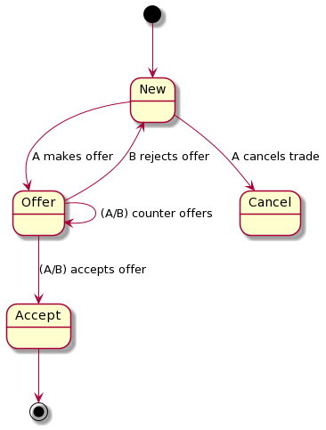
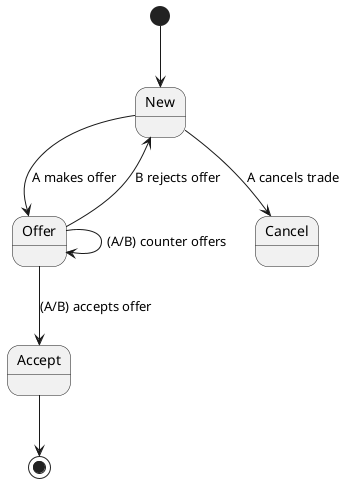

# Architecture

## High Level

| Inputs                | Entry Point | Game Loop |       Outputs |
| --------------------- | ----------- | --------- | ------------: |
| void \| saveFile.json | main.js     | game.js   | saveFile.json |

### `main.js`

Current boostrapping file for the environment the game will run in.

Provides to `game.js`:

- Event Bus (`eventBus`) -- backbone of the physical game loop. Must be synchronous.
- Game State (`gameState`) -- new state or loaded from `saveFile.json`.
- User Interface (`UI`) -- an interface bridging the game to an arbitrary UI to describe it.

### `game.js`

Describes the game loop by organizing necessary dependencies and queuing the game actions unto the passed `eventBus`.

We use the setup logic in `game.js` to bind our `UI` and `gameState` to all of our [`Rules`](###Rules%20Dictionary).

### Outputs

The game loop produces two outputs:

- `SIG_TERM` -- the game ends via a termination signal, outputting the associated code value.
- `Save` -- the game outputs a save file (dirty `gameState`); this does _not_ terminate the game.

## Game Loop Breakdown

```javascript
// Demonstrative code only to express high-level concepts
const Rules = {
    [ruleName: string]: [
        ...actions: function ({ UI, notify }, gameState): void Event?
    ]
}

while(eventBus.events && !SIG_TERM) {
    let nextEvent = eventBus.next();
    Rules[nextEvent.name].evaluate(nextEvent);
}
```

### Rules Dictionary

Game rules are written in the `Rules/index.js` file, which exists as a Dictionary with Keys of Rule Names and Values of an Array of Actions.

An Action is a function with the signature `function ({ UI, notify }, gameState): void Event?`, where:

- `UI` is the `User Interface` injected from `main.js`.
- `notify` is a function to produce the `void Event?` effect (i.e., broadcast an event to evaluate another rule).
- `gameState` is an object containing the game's state.

The game loop runs on the assumption that named `Events` have a one-to-one association to a `Rule`.

`Rule`s are stored in the dictionary (`Rules/index.js`) as a name with an ordered list of `Action`s that occur to evaluate the `Rule`. Think of it like steps take to follow or enact a rule. For example, a rule for moving a player piece around a board might be:

```javascript
const Rules = {
  /* ... */
  MOVE_PLAYER: [
    function promptCurrentPlayerToRollDice(_, gameState) {
      /* ... */
    },
    function movePlayerTokenSpacesEqualToDiceROll({ UI, notify }, gameState) {
      /* ... */
      notify('PLAYER_MOVED');
    },
  ],
  /* ... */
};
```

Note that calls to `notify` typically happen at the _end_ of a `Rule` (i.e., the last executed line of the last `Action` in the `Rule`'s array of `Action`s) and that the `eventBus` must be synchronous, as mentioned earlier.

> **Info:** This is not a "hard-and-fast" rule, but it does promote safer control flow logic. There are exceptions.

`notify` has a return type of `void` but it optionally broadcasts an `Event`, so we use the type signature `void Event?` to denote this.

> **Protip:** Looking for how something in the game works? Everything is in the `Rules/index.js` file. Open the file and you are likely to either find a `Rule` name matching what you're looking for, else a familiar `Rule` name that will enable you to trace through the logic flow.

## Components

Components attempt to facsimile real-world objects required of a board game (such as a dice, spinners, paper money, and even a board).

Not all components are required to be impemented as objects for all games (e.g., we can use a `Number` property on the `gameState` to track money or points instead of making `Token`s for them).

Review the `Components` folder to see what has been abstracted.

## Services

Services encapsulate behaviours of a component for use in other components. For example, the `PlayerActions` service encapsulates the behaviour of players interactions so that it can be injected into `Components` and `Rules`.

Other services:

- `WealthService` - interfaces all the money-related operations of a game

## Trade Finite State Machine Diagram





## Misc

..
